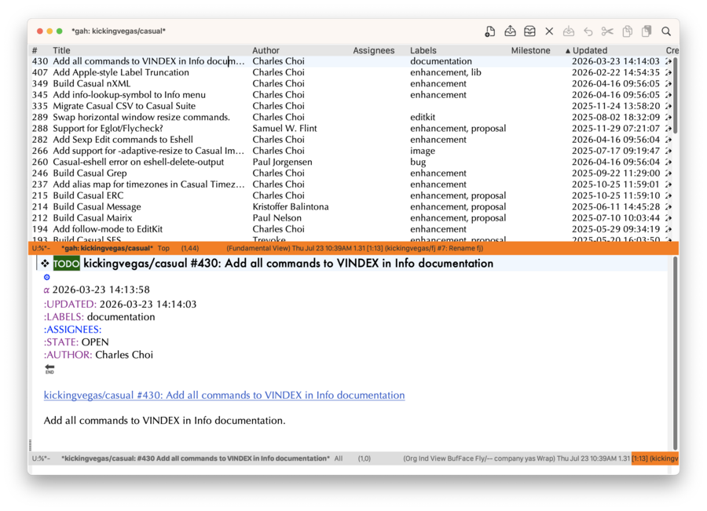
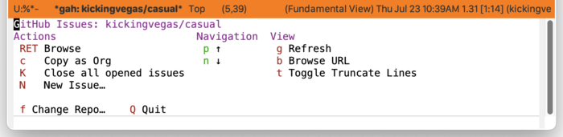

* gah - A Modest GitHub Issues Browser for Emacs

THIS IS WIP.

      

*gah* is an Elisp package that enables the browsing of GitHub issues via the command line utility [[https://github.com/cli/cli][gh]].

*gah* is limited in feature set by design: it is not intended to be a comprehensive wrapper around ~gh~.

* Features

- Browse issues for a repository:
  - Browse the issue under point in another Emacs window.
  - Copy the issue to the ~kill-ring~ in Org format.
  - Close all opened issues.
  - Refresh the issue list.
  - Switch to browse issues from a different repository.
  - Create a new issue.
  - Open a Transient menu for easy access to the above commands.

    
    
- Create an issue from an Org heading.
  

* Requirements

- Emacs 30.x+
- [[https://melpa.org/#/ox-gfm][ox-gfm]]
- The GitHub command line utility ~gh~ ([[https://github.com/cli/cli]])
- [[https://pandoc.org][Pandoc]]  (for Markdown to Org translation)
  

Both ~gh~ and ~pandoc~ must be installed and accessible from Emacs.
  
  
* Install

1. Ensure ~gah.el~ is in the ~load-path~ of your local Emacs configuration.
2. Customize the variable ~gah-username~ to your GitHub user name. This *must* be configured.

* Usage

~gah~ can be invoked using ~execute-extended-command~  ~M-x~:

#+begin_src shell
  M-x gah
#+end_src

You will be prompted to enter a repository name. Note that completion is available with the list of repositories in your GitHub account.

The issues for that repository will be listed in a new Emacs buffer named ~*gah: <repo name>*~. The following key bindings are available when the point is on an issue:

- C-o :: Open Transient menu for *gah* (~gah-issues-tmenu~).
- ~c~ :: Copy the issue in Org format (~gah-copy-issue~).
- ~RET~ :: Open the issue in another window, moving point to it (~gah-switch-to-issue~).
- q :: Quit, keeping buffer. (~quit-window~)
- Q :: Quit, killing buffer. (~View-kill-and-leave~)
- n, j :: Move point to next issue and open it in a new window (~gah-next-line~).
- p, k :: Move point to previous issue and open it in a new window (~gah-previous-line~).
- K :: Kill all opened buffers associated with this repository (~gah-kill-all-repo-buffers~).
- N :: Create a new issue (~gah-request-issue-create~)
- b :: Open issue in web browser. (~gah-browse-url~)
- TAB :: Move point to next column (~vtable-next-column~).
- <backtab> ::  Move point to previous column (~vtable-previous-column~).
- <double-mouse-1> :: Open issue in web browser (~gah-browse-url~)
  
** Create Issue
 
*gah* provides two ways to create an issue:

1. From the issue browser, press ~N~ to run ~gah-request-issue-create~.
2. From an Org file, using the command ~gah-create-issue~.

With ~gah-create-issue~, one can compose the issue in Org syntax using an Org heading. The content within the Org heading will be converted into GitHub Flavored Markdown (via ~ox-gfm~) that is put in the ~kill-ring~ for subsequent insertion.

Here's an example of using ~gah-create-issue~:

1. Compose issue in an Org file:

   #+begin_src org
     ,* I got a problem

     Let me tell you about my problem with ~foo~.
   #+end_src

2. With the point located anywhere within the heading subtree, run ~M-x~ ~gah-create-issue~.

3. You will be prompted to select a repository in the mini-buffer. Choose one.

4. A new compose window for the issue will be displayed. With the point in the compose window, use ~C-y~ (~yank~) to paste the GFM text (converted from the Org text).

5. Enter ~C-c C-c~ to create the issue on GitHub.
